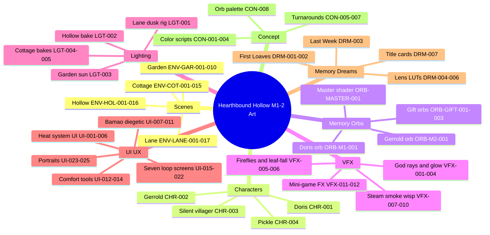

# 🗺️ Hearthbound Hollow — Environment Layouts (Mission 1–2)
### Top‑down asset placement · mission flow "miro" map · asset mind map · side‑view list
> Companion to the interactive [`ART_ENVIRONMENT_LAYOUTS.html`](ART_ENVIRONMENT_LAYOUTS.html) and the [`ART_PRODUCTION_DASHBOARD.html`](ART_PRODUCTION_DASHBOARD.html). Positions follow the Focus‑03 floor plans & blocking in `Docs/MASTER_BIBLE/Depth_Bible/Mission_1_2_Focus/03_SCENES_LANE_HOLLOW_GARDEN_COTTAGE.md`. Asset codes resolve in [`manifests/asset_manifest.csv`](manifests/asset_manifest.csv).

**How to read:** each scene is shown **top‑down (plan view)**. Assets are placed at their blocked positions and tagged with their code. The **View** column says whether an asset is best authored/judged from **TOP** (footprint), **SIDE** (elevation/height), or **BOTH**. Multiples (walls, fences, road tiles, trees) are noted as a set on the structure.

---

## ① The Village Lane at Dusk — top‑down (≈80 m one‑way walk)

```
  N↑ (plan view)        Cottage A   Cottage B   Cottage A      🐝 ENV-LANE-016
  ┌──────────────────────[ENV-LANE-001/002 line the lane]────────────[detour]──────┐
  ║ 🧱 ENV-LANE-004 ×14 (stone wall)        🍃 ENV-LANE-015 ivy        ☀️ VFX-001 god rays
  ║                                                                                  
 👣 ───cobble ENV-LANE-013───┬───dirt ENV-LANE-014───────────────┬──wood──► 🥖 ENV-LANE-003
 SPAWN  🏮606    🛒612   🌳608 │ 🪑607+🧑CHR-003   🏮606(lit bend) │  🪟VFX-002  👩‍🍳 CHR-001
  ║      🌲609     🌾611        │   (40 m)            (46 m)        │  Bakery     🪧 ENV-LANE-017
  ╚══════════════════════════════ 🧱 ENV-LANE-004 (stone wall) ════════════════════╝
  0 m            20 m           40 m            60 m            78 m    80 m (Forge Path closed)
```
*Lighting is the wayfinding: dim at spawn → warm at the bakery. Two NPCs only (Doris kneading at ~78 m; the silent villager reading on the bench at 40 m). The beehive at 65 m is an unmarked side‑path Easter egg.*

| Code | Asset | Pos (x,y m) | View |
|---|---|---|---|
| ENV-LANE-013 / 014 | Cobblestone → Dirt path bands | 0–25 / 25–72 | TOP |
| ENV-LANE-004 | Stone Wall Section 2m ×14 | both sides | BOTH |
| ENV-LANE-001 / 002 | Stone Cottage A ×3 / B ×2 | line the lane | SIDE |
| ENV-LANE-003 | Bakery (Doris's shop) + 🪟 VFX-002 glow | 76, 2 | BOTH |
| ENV-LANE-006 | Lamp Post ×2 (lit one = the bend anchor, 46 m) | 10 / 46 | BOTH |
| ENV-LANE-007 + CHR-003 | Bench + Silent Lane Villager | 40, 7 | BOTH |
| ENV-LANE-008 / 009 / 010 | Oak ×5 / Birch ×3 / Bush ×12 | scattered | BOTH |
| ENV-LANE-011 / 012 / 005 | Hay bales / Cart / Fence | mid‑lane | SIDE |
| ENV-LANE-015 / 016 / 017 | Ivy / Beehive / Forge‑Path sign | 33 / 65 / 80 | BOTH |
| CHR-001 | Doris the Baker | 77, 3 | BOTH |
| VFX-001 / 005 / 006 | God rays / Fireflies / Leaf‑fall | ambient | TOP/SIDE |

---

## ② The Hollow Interior — top‑down (shop 12×6 m + workbench 6×5 m)

```
              ┌───────────────────────────────┐
              │  UPSTAIRS (locked) 🚧 HOL-015 │
              └──────────────┬────────────────┘ doorway
   player ──► ┌──────────────┴────────────────┐
   from lane  │ SHOP ROOM 12×6                 │
   🔔 HOL-016 │ 🧾 HOL-001     📚 HOL-002  🔥 HOL-003
              │ counter       🟠⚪🟤 GIFT-1/2/3  stove
              │ 🪑🪑 HOL-004                    │
              │ 📕 HOL-014        🪟 HOL-005 → 🐈‍⬛ CHR-004
              │ 👩‍🍳CHR-001(M1)  🧓CHR-002(M2)   │ ← Pickle's spot
              └──────────────┬────────────────┘ doorway
              ┌──────────────┴────────────────┐
              │ WORKBENCH ROOM 6×5            │
              │ 📝 HOL-011 (note above bench) │
              │ 🥼 HOL-010   🛠️ HOL-006        │
              │ apron        🔮 HOL-007 cradle │   🍵 HOL-008 cabinet
              │              (ORB-M1/M2-001)   │   🫖 HOL-012 teapot
              │ 📖 HOL-013 ledger              │   🫖 HOL-009 kettle
              │           🚪 → Garden (M2)      │
              └───────────────────────────────┘
```
*Every prop foreshadows the predecessor (Marin), is loop‑functional, or is a place Pickle can sit. Realtime light budget: 4 (desk lamp, stove + 2). The 3 gift orbs and the apron/note/teapot/ledger are the predecessor seeds.*

| Code | Asset | View | Code | Asset | View |
|---|---|---|---|---|---|
| ENV-HOL-001 | Shop Counter | BOTH | ENV-HOL-009 | Kettle on Stove | BOTH |
| ENV-HOL-002 | Orb Shelf Unit ×3 | BOTH | ENV-HOL-010 | Marin's Apron | BOTH |
| ENV-HOL-003 | Wood Stove | BOTH | ENV-HOL-011 | Pinned Note | BOTH |
| ENV-HOL-004 | Reading Chairs ×2 | TOP | ENV-HOL-012 | Permanently‑Warm Teapot | BOTH |
| ENV-HOL-005 | Pickle's Windowsill | BOTH | ENV-HOL-013 | Evening Ledger | BOTH |
| ENV-HOL-006 | Workbench | BOTH | ENV-HOL-014 | Open Folklore Book | BOTH |
| ENV-HOL-007 | Orb Cradle + active orb | BOTH | ENV-HOL-015 | Staircase Barrier | SIDE |
| ENV-HOL-008 | Tea Cabinet | TOP | ENV-HOL-016 | Door Bell | TOP |
| ORB-GIFT-001/2/3 | Bee / Kettle / Empty‑Chair gift orbs | BOTH | CHR-004 | Pickle | BOTH |

---

## ③ The Herb Garden — top‑down (4 raised beds; brightest scene)

```
        ┌────────[ Hollow back wall ]──🚪──────────┐
        │            🪨 ENV-GAR-008 stepping stones │
        │              (path down from the door)    │
        │   ┌─────────┐        ┌─────────┐          │
        │   │ BED 1   │        │ BED 2   │          │
        │   │ 🌸 GAR-002│       │ 🌱 GAR-003│   ENV-GAR-001
        │   │ lavender │        │ valerian │   (raised bed ×4)
        │   └─────────┘        └─────────┘          │
        │   ┌─────────┐        ┌─────────┐          │
        │   │ BED 3   │        │ BED 4   │  🌫️ VFX-009
        │   │ empty   │        │ empty   │   tea steam
        │   └─────────┘        └─────────┘          │
        │  ⛏️ GAR-005  🧺 GAR-006   🪣 GAR-004 + 🪑 GAR-009
        │  🪴 ENV-GAR-010 ×3        (watering can on stool)
        └──────[ low wooden fence ENV-GAR-007 ]─────┘
              beyond: meadow — walled off (M3+)
```
*Mission 2 opens the workbench‑room door into this. Lavender (Calm, D‑minor) + Valerian (Sleep, G‑sus); two beds empty for M3+. The brightest, most‑lit scene — the cozy contrast principle.*

---

## ④ The Widower's Cottage — top‑down (exterior approach + interior)

**Exterior & side‑lane approach (~35 m)**
```
  main lane ──► 🏮🏮🏮 VFX-003 (3 lanterns, wayfinding)   ┌──────────────┐
                side lane · light fog A-16 · Gerrold      │ 🐦 COT-005   │
                paces beside you (1.5 m/s)                │ 🥀 COT-006   │
                                                          │ 🪟 COT-004   │
                                              🪵 COT-002 ─►│ 🚪 soft-blue │ 🏠 ENV-COT-001
                                              🟫 COT-003   │   door       │
                                                          └──────────────┘
```
**Interior**
```
        ┌──────────────────────────────────┐
        │ 🔥 ENV-COT-014 hearth   🖼️ COT-012 │  (wedding photo on the mantel)
        │        ▭ rug                       │
        │ 🪑 COT-007 Gerrold's chair 🧓CHR-002│
        │ 🧰 COT-013 toolbox (under chair)   │
        │ 🪑 COT-008 Margery's chair 📖COT-009│  ┌──────────────┐
        │                                    │  │ 🍽️ COT-011    │ two settings
        │            small table ────────────┼─►│ ☕ COT-010     │ (one unused)
        │                                    │  └──────────────┘  cold tea
        │ 🚪 ENV-COT-015 closed bedroom door │  (steady light leak — M5+)
        └──────────────────────────────────┘
```
*80% mood, 20% prop. Realtime light budget: 2 (hearth + mantel). The cup of cold tea makes no sound — intentional silence.*

---

## 🔀 Mission 1–2 Flow Map ("miro" route)

```mermaid
flowchart LR
  A["① Village Lane · dusk<br/>ENV-LANE-003 · CHR-001 · VFX-001"] -->|fade 2s| B["② Hollow Shop<br/>ENV-HOL-002 · ORB-GIFT-1/2/3 · CHR-004"]
  B -->|reveal 8s · Pickle| C["② Workbench · Polish<br/>ENV-HOL-006 · ORB-M1-001 · VFX-011"]
  C --> D["② Evening Ledger<br/>ENV-HOL-013 · UI-008"]
  D -->|sleep 3s| E(["🌙 Dream 1 · First Loaves<br/>DRM-001 · DRM-002"])
  E -->|morning 4s| F["③ Herb Garden<br/>ENV-GAR-002 · ENV-GAR-003 · VFX-009"]
  F -->|walk + Gerrold| G["④ Walk to Cottage<br/>CHR-002 · VFX-003"]
  G --> H["④ Cottage · Cleanse choice<br/>ORB-M2-001 · VFX-012 · UI-011"]
  H -->|sleep 3s| I(["🌙 Dream 2 · The Last Week<br/>DRM-003 · DRM-004/5/6"])
  I -->|pan 30s| J["② Mission Outro<br/>ENV-HOL-002 · UI-006"]
```



---

## 🧠 Asset Mind Map



---

## 📐 Assets that must also be authored from the SIDE (elevation)

Top‑down placement is not enough for these — their **height, silhouette and stacking** carry the read. The interactive HTML draws each as a small elevation diagram.

| Code | Asset | Why side‑view matters |
|---|---|---|
| ENV-LANE-001/002/003 | Cottages & bakery | rooflines + lit windows are the skyline silhouette |
| ENV-HOL-002 + ORB-GIFT | Orb shelves (3 tiers) | the gift orbs read by their stacked height |
| ENV-HOL-003 + VFX-008 | Wood stove + chimney smoke | flame glow + smoke plume above the roof |
| ENV-LANE-006 / VFX-003 | Lamp post / lantern | halo height drives the wayfinding |
| ENV-LANE-008 + VFX-001 | Autumn tree + god rays | canopy gaps shape the light shafts |
| ORB-MASTER-001 | Memory orb on cradle | the hero — refraction, fresnel rim, cracks |
| ENV-COT-014 + ENV-COT-012 | Hearth, mantel & wedding photo | fire glow + the photo on the mantel |
| ENV-COT-004 | Half‑drawn curtain window | the half‑draw is a vertical gesture |
| ENV-COT-005 / 006 | Bird feeder / dead lavender | hang from hooks — vertical mood‑tellers |
| ENV-HOL-010 / 011 | Marin's apron / pinned note | hang at eye level on the wall |
| CHR-004 | Pickle on the windowsill | always visible in elevation |
| ENV-COT-002 | Split front step | the split reads in profile |

---
*Environment Layouts v1.0 · `feat/mission-1-2-architecture`. Schematic‑accurate to the Focus‑03 blocking; once scenes are assembled, the Unity transforms are the source of truth.*
